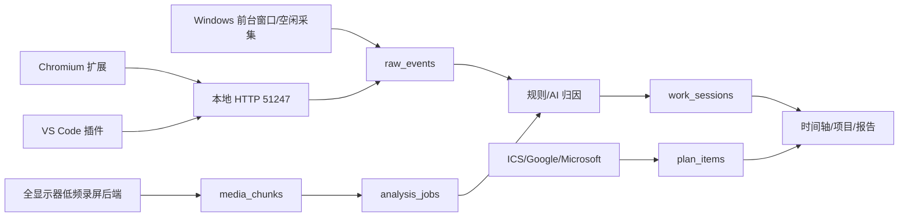

# ScreenUse Architecture

## 数据流

## 核心约束

- 人工确认的 `work_sessions.user_confirmed=1` 永远优先，AI 重分析不得覆盖。
- 原始媒体只作为临时分析材料，分析成功后删除；长期保存 AI 摘要、元数据、置信度、证据。
- 外部日历集成只读，不回写来源文件。
- 当前 Windows 实现先保证可用；Collector/Integration/Export trait 为 macOS/Linux 预留。

## 关键接口

- `CollectorAdapter`：启动/停止采集，写入 `RawActivityEvent`。
- `IntegrationAdapter`：导入 DDL/ICS/日历/待办计划。
- `ExportProvider`：导出 CSV/Excel/Markdown。
- `OpenAiCompatibleClient`：统一 OpenAI 兼容模型接入。
