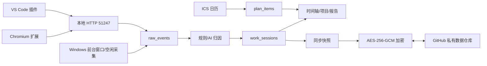

# ScreenUse Architecture

## 数据流

## 核心约束

- 人工确认的 `work_sessions.user_confirmed=1` 永远优先，AI 重分析不得覆盖。
- AI 复核按最多 8 条目标批处理；每条目标携带前后 30 分钟会话上下文，分类目录包含全部现有分类、项目和任务。
- AI 只能返回目录中已有的项目和任务 ID；结果更新原会话，不创建覆盖同一时间范围的新会话。
- 默认采集链路只保存前台应用、当前页面/文档标题和少量上下文元数据，不截图、不录屏。
- 外部日历集成只读，不回写来源文件。
- GitHub 同步只上传端侧加密快照；Token 和同步密钥只保存在系统凭据库。
- 同步采用记录级最后写入优先和删除墓碑，远端 SHA 只用于乐观并发控制。
- 当前 Windows 实现先保证可用；Collector/Integration/Export trait 为 macOS/Linux 预留。

## 关键接口

- `CollectorAdapter`：启动/停止采集，写入 `RawActivityEvent`。
- `IntegrationAdapter`：导入 ICS/日历计划。
- `ExportProvider`：导出 CSV/Excel/Markdown。
- `analyze_with_codex_account`：通过本机 `codex exec --ephemeral` 复用当前 ChatGPT 登录，默认使用 `gpt-5.6-luna` 和结构化输出。
- `OpenAiCompatibleClient`：保留自定义 OpenAI-compatible API 接入。
- `github_sync`：生成快照、加密、GitHub Contents API 传输、冲突合并和后台调度。
